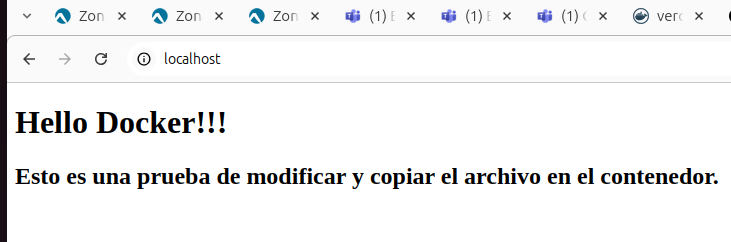

# Fundamentos de contenerización


## Actividad 1. Servidor Web Simple con Nginx.


### Paso 1: Construcción de la imagen
```
sudo docker build -t 107fcproyecto1:1.0 .
```
 
### Paso 2. Ejecutar el contenedor en el puerto 80, 100fcproyecto1 
```
sudo docker run -d -p 80:80 --name 107fcproyecto1 107fcproyecto1:1.0
```
 
### Paso 3. Comprobación: http://localhost 

 
### Paso 4. Se pide modificar el fichero index.html desde el contenedor. 
No deja utilizar nano, por lo que se ha modificado el fichero en el host.
y copiado en la carpeta del contenendor.
```
docker cp index.html 107fcproyecto1:/usr/share/nginx/html/index.html

```
para ver si se ha copiado bien
```
docker exec -it 100fcproyecto1 cat /usr/share/nginx/html/index.html

```
  

### Enlace a Docker hub : https://hub.docker.com/repository/docker/verogmayo/107fcproyecto1/general
